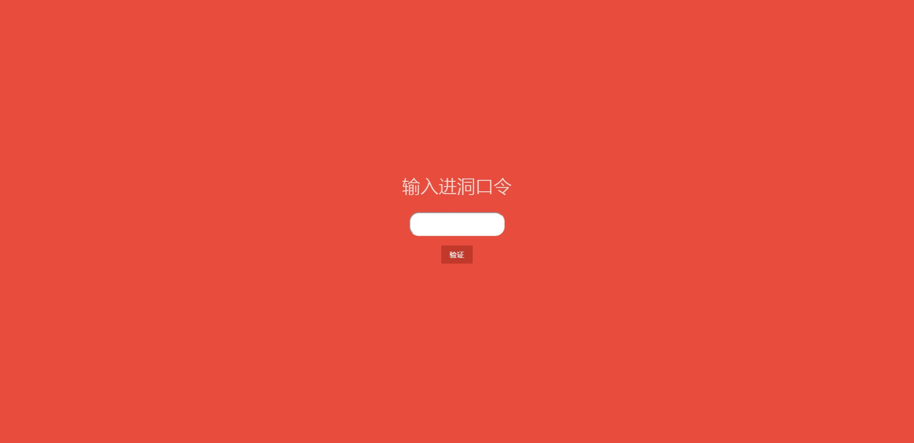
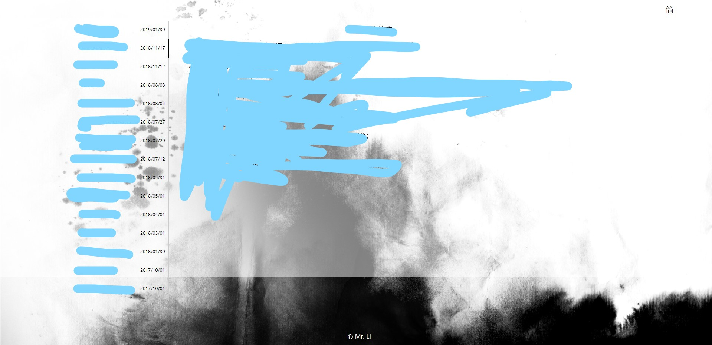
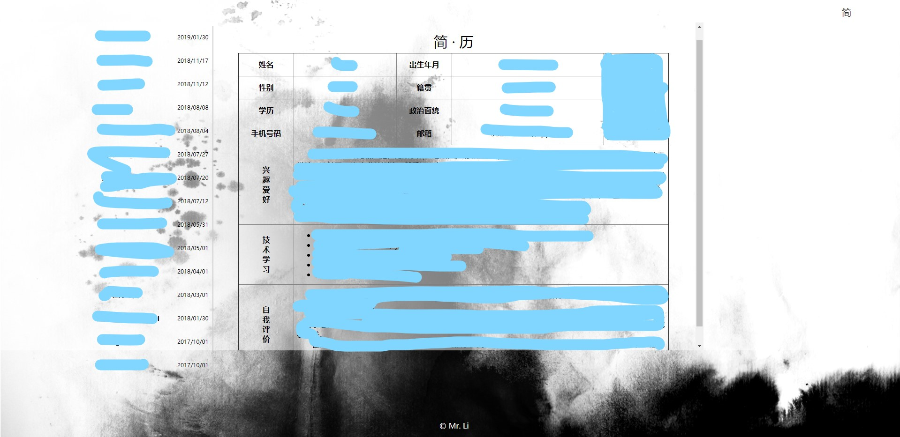

# resumeUI
A reference about the webpage design on resume and personal experience

## Introduction
这是本人初次接触vue时，用于练手，写的一个简单的纯前端的用于存放个人简历和事务的时间线网页。

结构是index.html写各项事务名称、日期，neirong.html写简历具体内容以及对应的事务的内容。

另外，./index文件夹下的test.html和test.php是验证访问者身份用到的前后端文件，用到的模态窗样式是Nifty Modal Window Effects这个开源库。

展示项目内容根据json格式解析，目前仅支持一段文字和一张图片，也是比较简化。

`Tips`无关和隐私文件已删除，具体的事务json以及简历信息可根据各自情况进行填充

## EffectPics
`验证入口`

`整体布局`

`简历布局`

